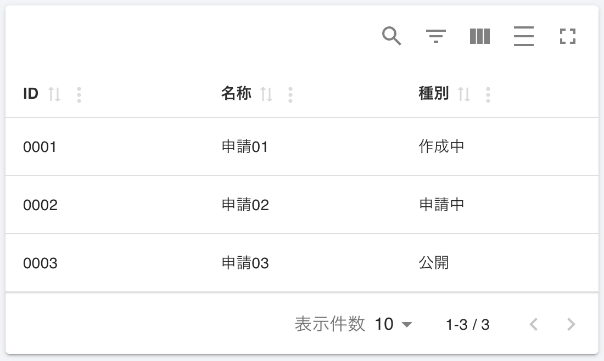
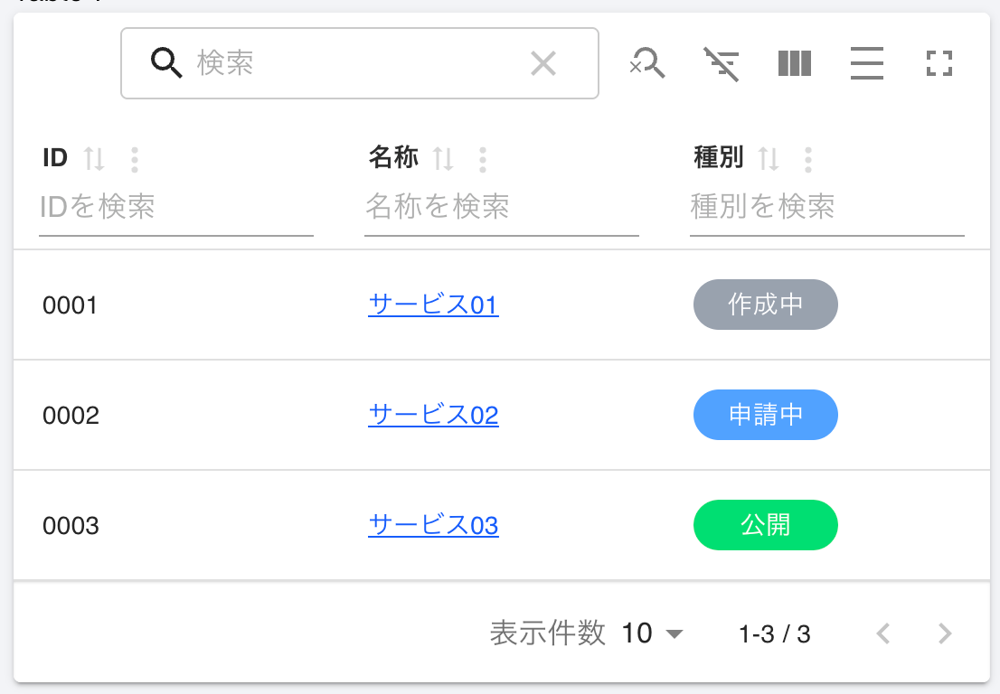
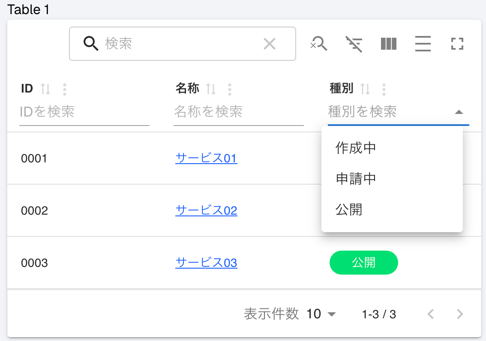
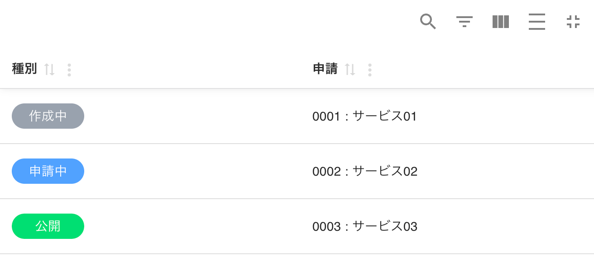

# Material React Tableの使い方
Material React Tableの概要と使い方を紹介

## 概要
TanStackTable(テーブルロジックを提供)と
MUI(materialUI / 高品質なマテリアルデザインを提供)を組み合わせて作られた  
テーブルのソート・検索・ページネーション等の機能が備わった  
react(Next)向けの高機能なテーブルライブラリ


公式サイト  
https://www.material-react-table.com/


## next install
pnpm create next-app

## 起動
pnpm dev

## MRT install
pnpm add material-react-table
or
pnpm add material-react-table @mui/material @mui/x-date-pickers @mui/icons-material @emotion/react @emotion/styled

今回使用するのは現時点最新のv3

## 使い方
まずはimport
```
import { MaterialReactTable } from "material-react-table";
import { MRT_Localization_JA } from 'material-react-table/locales/ja' //日本語化
```

するとコンポーネントが使えるようになるので、
表示するデータ(data)と列の定義(columns)を渡す

columnsではaccssorKeyとしてdataのキーを
列名としてheaderを設定する
```
const data = [
{ id: "0001", name: "サービス01", status: "作成中", link: "/detail/1" },
{ id: "0002", name: "サービス02", status: "申請中", link: "/detail/2" },
{ id: "0003", name: "サービス03", status: "公開", link: "/detail/3" },
];

~~

<MaterialReactTable
    localization={MRT_Localization_JA} //日本語化
    columns={[
    {
        accessorKey: "id",
        header: "ID",
    },
    {
        accessorKey: "name",
        header: "名称",
    },
    {
        accessorKey: "status",
        header: "種別",
    },
    ]}
    data={data}
/>
```


表示できました

これだけでページ送りやテーブル内の検索・並び替えなどもデフォルトでついてます


## セル内で任意のhtmlを使用する
セル内部で単純な文字列表示だけでなくリンクの追加や任意のスタイルを当てて装飾をしたいのでCellを使用して以下のように追記


```
{
    accessorKey: "name",
    header: "名称",
    Cell: ({ cell }) => {
        return (
            <Link href={cell.row.original.link} className="text-blue-600 underline">
            {cell.getValue<string>()}
            </Link>
        );
    },
},
{
    accessorKey: "status",
    header: "種別",
    Cell: ({ cell }) => (
    <span
        className={`block w-20 leading-[2] text-center text-white rounded-2xl bg-gray-400`}
    >
        {cell.getValue<string>()}
    </span>
    ),
},
```


htmlを変更してスタイルを当てれた


## テーブル内での絞り込み
デフォルトでもフリーテキストの入力による絞り込みはできるのだが、
要素セレクトでの絞り込みに対応したかったのでfilterVariantとfilterSelectOptionsを以下のように追加

```
{
    accessorKey: "status",
    header: "種別",
    filterVariant: "select",
    filterSelectOptions: [
        { label: "作成中", value: "作成中" },
        { label: "申請中", value: "申請中" },
        { label: "公開", value: "公開" },
    ],
 ~~
}
```

元


追加後



## 1つのセルに複数データを表示した場合の検索
例えば以下のような感じで1つのセルにIDと名称をまとめて表示したとする

```
{
    accessorKey: 'id',
    header: '申請',
    grow: true,
    Cell: ({ cell, row }) => (
        <span>{cell.getValue<string>()} : {row.original.name}</span>
    )
},
```

IDとnameを同じセルに表示


この時、表示はうまくいっているように見えるが、検索してみるとaccesorKeyに指定したIDでの検索ではヒットするが、nameに当たる文字列で検索しても結果なしとなってしまう

テーブル全体での検索結果


列での検索結果


どうやらfilterFnというものを使って独自に検索関数を作成し適応できるようなので対応してみる

```
{
    accessorKey: 'id',
    header: '申請',
    grow: true,
    Cell: ({ cell, row }) => (
        <span>{cell.getValue<string>()} : {row.original.name}</span>
    ),
    filterFn: (row, _columnId, filterValue) => {
    const id = row.original.id?.toString().toLowerCase() || ''
    const name = row.original.name?.toLowerCase() || ''
    const searchValue = filterValue.toLowerCase()

    return id.includes(searchValue) || name.includes(searchValue)
    }, // IDとnameでの部分一致検索を列の検索に実装
},
```

列の検索を実装して、ヒットするようになった


列定義でのfilterFnでは列内での検索だけの実装なので、テーブル全体の検索でもnameでヒットするように実装する

```
import { MaterialReactTable, MRT_FilterFn } from "material-react-table";

~~

  const customGlobalFilter: MRT_FilterFn<DataType> = (row, _columnIds, filterValue) => {
    const searchValue = String(filterValue).toLowerCase();
    
    // 検索対象のキー
    const keysToSearch: (keyof DataType)[] = ['id', 'name', 'status'];
    
    return keysToSearch.some((key) => {
      const value = row.original[key];
      if (value == null) return false;
      return String(value).toLowerCase().includes(searchValue);
    });
  };


~~

<MaterialReactTable
    localization={MRT_Localization_JA}
    columns={[
        ~~~
    ]}
    data={data}
    globalFilterFn="customGlobalFilter"
    filterFns={{
        customGlobalFilter: customGlobalFilter
    }}
/>
```

テーブル全体での検索もnameを対象にできるようになった


これはとてもめんどくさいな、と思ってさらに調べると
今回のような単純な複数データの検索ならaccessorFnというものでも良いらしかった

```
{
    accessorFn: (row) => `${row.id} : ${row.name}`,
    header: '申請',
},
```

面倒なことをせずともこれだけで全体・列共に検索対応できた


## 所感
サイトの表側で高機能なテーブルが必要になる事は多くなさそうだが、reactで管理画面なんかを作る場合には重宝するのではと感じた。

(今回は使っていないがreactを使わない場面では元となるtanStackTable ( https://tanstack.com/table/latest )を使うと機能面では似たような事もできる..はず)

検索については指摘を受けるまで検索ができていなかった事に気づいていなかったので見落としがちなポイントかと思い紹介した。
検索の実装については面倒な手法を先にやろうとしてしまったので時間がかかったが、シンプルなものでよければ簡単に対応でき、今回はやらなかったが例えば表示する内容とヒットさせたい内容が異なる場合(テーブルに載せない詳細ページの情報でもヒットさせたい)など複雑な検索をさせたい場合には検索関数を実装して使用する事ができる事もわかった。